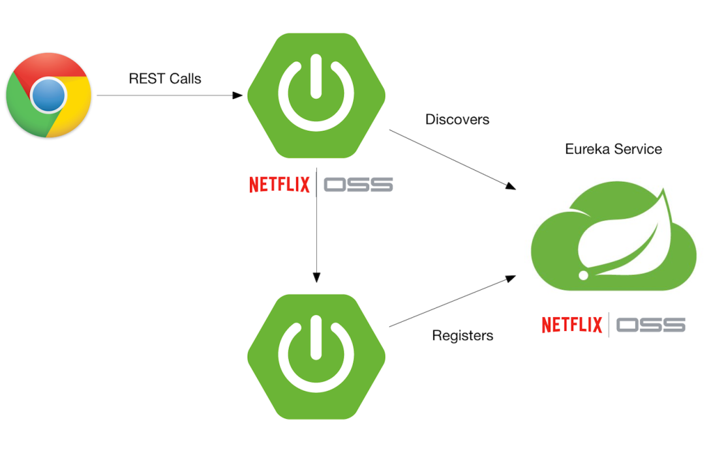

# Spring Cloud Netflix Eureka Microservices

This repository contains a microservices-based project that demonstrates the implementation of a **User Service** and a
**Notification Service** using **Spring Boot**, **Eureka Discovery Server**, and **MongoDB/PostgreSQL**. The system
leverages **Feign Clients** for inter-service communication and integrates with **Eureka Server** for service
registration and discovery.

## Technologies Used

- **Spring Boot** for microservices.
- **Spring Cloud** for service discovery and Feign integration.
- **MongoDB** and **PostgreSQL** as databases.
- **Docker** for containerization.
